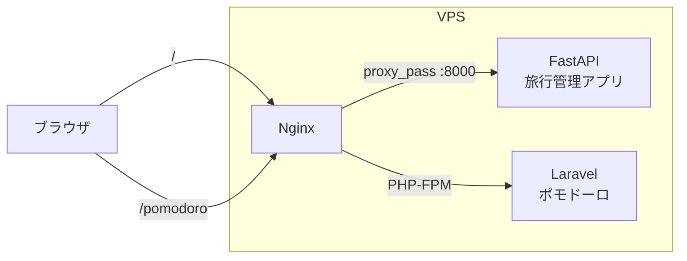

# Laravel Pomodoro Timer

シンプルなポモドーロタイマーを **Laravel** で実装した個人開発プロジェクトです。
「まずは最小限の機能でいいから、本番環境に載せて動かす（MVP）」をテーマにしています。

既に同じ VPS 上で運用している **FastAPI 製の旅行管理アプリ** と同じドメインに、
この Laravel アプリを **サブパス `/pomodoro` として共存** させています。

* 本番 URL（ポモドーロ）: `https://travel-manager.xvps.jp/pomodoro`
* 本番 URL（旅行管理アプリ / FastAPI）: `https://travel-manager.xvps.jp/`

> ※ ドメインはポートフォリオ用のため、将来構成や URL を変更・クローズする可能性があります。

---

## プロジェクト概要

* 25分作業を想定したシンプルなポモドーロタイマー
* スタート／ストップ／リセットなど、必要最低限の操作のみ
* Laravel の基本要素を一通り利用

  * ルーティング
  * コントローラ
  * Blade ビュー
  * Feature テスト
* **既存の FastAPI 本番アプリを止めずに**
  同じ VPS・同じドメイン配下に Laravel アプリを追加

---

## 技術スタック

### アプリケーション

* PHP 8.4
* Laravel 12.x
* Blade テンプレート
* PHPUnit（Feature テスト）

### インフラ・ミドルウェア

* Ubuntu（Xserver VPS）
* Nginx
* PHP-FPM（`php8.4-fpm`）
* FastAPI + Uvicorn（既存サービス / ルートパス `/` で稼働）
* Let’s Encrypt + Certbot（TLS 証明書）

---

## アーキテクチャ構成

### URL と役割

* `https://travel-manager.xvps.jp/`
  → Nginx → Uvicorn（FastAPI 旅行管理アプリ）
* `https://travel-manager.xvps.jp/pomodoro`
  → Nginx → PHP-FPM → Laravel（ポモドーロタイマー）

### Nginx 構成イメージ（簡略）



※ 実際の Nginx 設定では、1つの `server` ブロック内で
`location /` と `location /pomodoro/` を使って振り分けています。

---

## ローカル開発環境での動かし方

### 1. クローン

```bash
git clone https://github.com/goro8/laravel-pomodoro.git
cd laravel-pomodoro
```

### 2. 依存関係インストール

```bash
composer install
```

### 3. 環境変数ファイルの作成 & アプリキー生成

```bash
cp .env.example .env
php artisan key:generate
```

今回のポモドーロタイマーでは DB をほとんど使っていないため、
セッションはファイルドライバを利用しています（`.env` 内）:

```env
SESSION_DRIVER=file
```

### 4. 開発サーバの起動

```bash
php artisan serve
```

ブラウザで `http://127.0.0.1:8000` にアクセスすると、ポモドーロ画面が表示されます。

---

## テスト

最低限の Feature テストを用意しています。
トップページにポモドーロタイマー画面が表示されることを確認します。

```bash
php artisan test --filter=PomodoroPageTest
```

* HTTP ステータスコード 200 が返ること
* ページ内に特定のテキスト／要素が含まれていること

---

## 本番デプロイ概要メモ

本番環境では `php artisan serve` ではなく、Nginx + PHP-FPM 経由で動作させています。

### 大まかな流れ

1. VPS に PHP / PHP-FPM / Composer をインストール
2. `/var/www/laravel-pomodoro` に本リポジトリを `git clone`
3. `composer install --no-dev --optimize-autoloader`
4. `.env` 作成 & `php artisan key:generate`
5. `storage` / `bootstrap/cache` ディレクトリのパーミッション調整
6. Nginx 設定を編集し、

   * `/` → FastAPI（既存アプリ）
   * `/pomodoro` → Laravel
     になるように `location` を設定

### ポイント

* **既存の FastAPI 本番サービスを止めずに**、
  Laravel をサブパスとして追加する構成を採用しました。
* Nginx のログ（`access.log` / `error.log`）と Laravel のエラー画面で、
  どこまでリクエストが到達しているかを確認しながら調整しました。

---

## 今後の改善案・拡張アイデア

* カウント履歴の保存（今日何ポモやったか、などの簡易ログ）
* ログイン機能を追加して、ユーザーごとの履歴を管理
* モバイル向け UI 調整（スマホサイズでの操作性向上）
* 多言語対応（日本語／英語／中国語など）
* URL 設計の見直し

  * 例:

    * `app.example.com/travel` … 旅行管理アプリ
    * `app.example.com/pomodoro` … ポモドーロタイマー
  * 今回は既存ドメイン上にサブパスで同居させる構成を優先

---

## このプロジェクトで学んだこと

* Laravel プロジェクトの新規作成〜 GitHub 公開までの流れ
* VPS 上での Laravel デプロイ（PHP-FPM / Composer / パーミッション設定）
* Nginx を使って、1台の VPS・1つのドメインで
  **FastAPI と Laravel をサブパス単位で共存させる構成**
* 「Nginx の 404」と「Laravel の 404」の違いから、
  どこまでリクエストが届いているかを判断する方法
* セッションドライバの設定ミス（`database` → `file`）など、
  実際にハマりながらエラーの原因を特定していく手順
